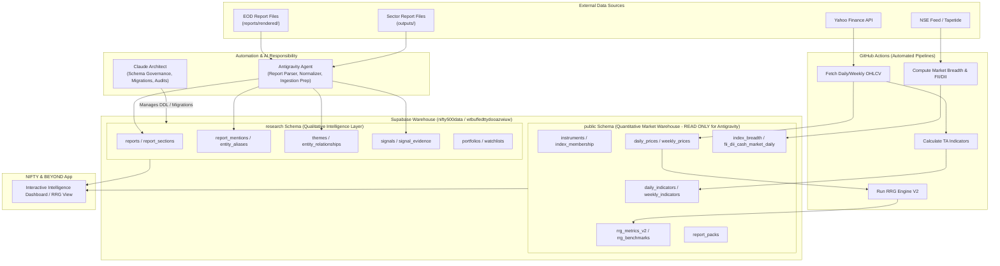

# NIFTY & BEYOND — Phase 3: Existing `nifty500data` Database Architecture Map

> **Role:** Senior Data Architect Read-Only Audit  
> **Tagline:** What the index doesn't tell you  
> **Target Database:** `nifty500data` (`wtbufledttydooazwiuw`)  
> **Status:** READ-ONLY AUDIT COMPLETE (Zero database mutations executed)

---

## 1. Executive Summary

This architecture map presents a comprehensive read-only audit of the existing **`nifty500data`** Supabase database (`wtbufledttydooazwiuw`). Following the strategic architecture decision, **`nifty500data` is established as the single canonical quantitative market-data and analytics warehouse** for all current and future applications.

### Key Audit Highlights:

1. **Warehouse Maturity:** `nifty500data` is a fully structured quantitative market warehouse containing **26 database objects** (23 in `public`, 2 system views in `extensions`, 1 migration log in `supabase_migrations`).
2. **Quantitative Coverage:** Houses 539 tracked stock/index instruments, **172,827 daily price & indicator records**, **80,591 weekly price bars**, **22,819 RRG relative rotation metrics**, market breadth history, daily FII/DII institutional flows, and packaged report JSON payloads.
3. **Zero Mutation Compliance:** In strict accordance with Phase 3 instructions, no tables were created, altered, renamed, or modified. Zero records were inserted or deleted.
4. **Architectural Recommendation:** Introduce a decoupled, additive **`research` schema** within the `nifty500data` database. This provides 100% namespace isolation, preventing any collision with existing market tables while linking qualitative intelligence (reports, themes, signals, evidence, portfolio tracking) directly to quantitative instruments via foreign keys.

---

## 2. Actual Supabase Project Identity

* **Project Name:** `nifty500data`
* **Project Reference:** `wtbufledttydooazwiuw`
* **Connection Endpoint:** `aws-0-ap-south-1.pooler.supabase.com:5432/postgres`
* **Primary Role:** Central Quantitative Market Data, Technical Indicators, Market Breadth & RRG Engine Warehouse
* **Access Mode:** Strict Read-Only Audit

---

## 3. Existing Schema Inventory

The `nifty500data` database comprises 26 total tables/views distributed across PostgreSQL schemas:

```
nifty500data (wtbufledttydooazwiuw)
├── extensions (2 views)
│   ├── pg_stat_statements
│   └── pg_stat_statements_info
├── supabase_migrations (1 table)
│   └── schema_migrations (8 records)
└── public (23 objects)
    ├── Master & Universe (3)
    │   ├── instruments (539 rows)
    │   ├── index_membership (2,022 rows)
    │   └── current_index_members [VIEW] (1,512 rows)
    ├── Price Series & Technical Indicators (5)
    │   ├── daily_prices (172,827 rows)
    │   ├── daily_indicators (172,827 rows)
    │   ├── daily_price_indicators [VIEW] (172,827 rows)
    │   ├── weekly_prices (80,591 rows)
    │   └── weekly_indicators (73,045 rows)
    ├── Market Breadth, Macro Flows & Governance (3)
    │   ├── index_breadth (10,368 rows)
    │   ├── fii_dii_cash_market_daily (39 rows)
    │   └── data_coverage_log (10 rows)
    ├── RRG Engine V2 (11)
    │   ├── rrg_benchmarks (22 rows)
    │   ├── rrg_instruments (539 rows)
    │   ├── rrg_universe_v2 (213 rows)
    │   ├── rrg_constituents (1,349 rows)
    │   ├── rrg_metrics_v2 (22,819 rows)
    │   ├── rrg_week_picker (150 rows)
    │   ├── rrg_config (6 rows)
    │   ├── rrg_engine_v2_config (6 rows)
    │   ├── rrg_calculation_runs (0 rows)
    │   ├── rrg_data_quality (0 rows)
    │   └── rrg_events (0 rows)
    └── Packaged Payload Storage (1)
        └── report_packs (6 rows)
```

---

## 4. Existing Market Infrastructure

### Primary Master Tables

* **`public.instruments`**: Authoritative master registry for all tracked assets.
  * **Columns:** `id` (bigint PK), `symbol` (text), `name` (text), `instrument_type` (text), `industry` (text), `sector` (text), `isin` (text), `nifty_500_member` (boolean), `nifty_50_member` (boolean), `yahoo_symbol` (text), `created_at`, `updated_at`.
  * **Coverage:** 539 total instruments (Nifty 500 equities, Nifty 50, Sector indices, Broad market benchmarks).

* **`public.index_membership`**: Relational junction table mapping stock instruments to index instruments with weights and effective dates.
  * **Columns:** `id` (bigint PK), `index_instrument_id` (FK -> `instruments.id`), `stock_instrument_id` (FK -> `instruments.id`), `effective_date` (date), `weight_pct` (numeric).

* **`public.current_index_members`**: Convenience view joining `index_membership` and `instruments` to expose active index constituent listings.

---

## 5. Existing Universe Architecture

The existing architecture cleanly supports stocks belonging to multiple universes simultaneously:
1. **Nifty 50 Universe:** Flagged via `instruments.nifty_50_member = true` and `index_membership` where `index_instrument_id = 1` (NIFTY 50).
2. **Nifty 500 Universe:** Flagged via `instruments.nifty_500_member = true` and mapped in `index_membership`.
3. **Sector Universes:** Linked via `instruments.sector` and `index_membership` linking stocks to sector index instruments (e.g., NIFTY METAL, NIFTY BANK, NIFTY IT).
4. **RRG Universes:** Configured in `rrg_universe_v2` linking parent benchmark IDs to constituent instruments.

> **Universe Multi-Membership Audit Verdict:** **FULLY SUPPORTED.** No modification to existing universe structures is required.

---

## 6. Existing RRG (Relative Rotation Graph) Architecture

The RRG engine in `nifty500data` is an institutional-grade v2 implementation:

* **`rrg_benchmarks`** (22 rows): Defines benchmark index targets (NIFTY 50, NIFTY 500, Sector indices).
* **`rrg_instruments`** (539 rows): RRG shadow master table mapped to `public.instruments.id`.
* **`rrg_universe_v2`** (213 rows): Parent-child universe definitions for sector-to-index and stock-to-sector rotation analysis.
* **`rrg_constituents`** (1,349 rows): Historical weighting of constituent stocks within benchmark universes.
* **`rrg_week_picker`** (150 rows): Friday date-alignment calendar ensuring standard week-ending boundaries (from 2023-09-01 to 2026-09-04).
* **`rrg_metrics_v2`** (22,819 rows): Authoritative RRG metric calculation repository.
  * **Core Fields:** `rs_raw`, `rs_ema`, `rs_ratio`, `rs_momentum`, `quadrant` (`Leading`, `Weakening`, `Lagging`, `Improving`), `direction`, `relative_return_4w`, `relative_return_13w`, `relative_return_26w`, `calculation_version`.

---

## 7. Existing Indicator Architecture

Quantitative technical indicators are pre-computed and stored in high-performance daily and weekly tables:

* **`public.daily_indicators`** (172,827 rows): PK `(instrument_id, date)`.
  * **Calculated Metrics:** `rsi_14`, `atr_14`, `adx_14`, `sma_20`, `sma_50`, `sma_200`, `ema_20`, `ema_50`, `ema_200`.
* **`public.weekly_indicators`** (73,045 rows): PK `(instrument_id, week_end)`.
  * **Calculated Metrics:** `rsi_14`.
* **`public.daily_price_indicators`** [VIEW]: Seamless single-query view combining OHLCV price series and technical indicators.

---

## 8. Existing Breadth / FII-DII / Regime Architecture

* **`public.index_breadth`** (10,368 rows): Market breadth metrics across major indices.
  * **Metrics:** `advances`, `declines`, `unchanged`, `advance_decline_ratio`, `pct_above_20dma`, `pct_above_50dma`, `pct_above_200dma`.
* **`public.fii_dii_cash_market_daily`** (39 rows): Daily institutional cash flows.
  * **Metrics:** `fii_buy_val`, `fii_sell_val`, `fii_net_val`, `dii_buy_val`, `dii_sell_val`, `dii_net_val` (in INR Cr).
* **Market Regime Infrastructure:** Market regime (e.g. *Bullish Momentum*, *Narrow Breadth*, *Distribution*) is computed dynamically by combining `index_breadth` (% > 50 DMA) and index moving average alignment from `daily_indicators`.

---

## 9. Existing Datapack Architecture

* **`public.report_packs`** (6 rows): PK `report_date`.
  * **Columns:** `report_date`, `pack_version`, `built_at`, `pack` (JSONB payload).
  * **Role:** Serves pre-built daily report packs to web dashboards and mobile views.

---

## 10. EOD Research Source Architecture

* **Source Directory:** `D:\Anti Gravity\post-market-report\reports\rendered`
* **Artifacts:** Daily Brief (`2026-09-04-daily-brief.html`) and Weekly Brief (`2026-09-04-weekly-brief.html`).
* **Generation Engine:** Generated via Python scripts combining Supabase quantitative queries (`report_packs`, `daily_indicators`, `fii_dii_cash_market_daily`, `rrg_metrics_v2`) and macro intelligence.

---

## 11. Sector Research Source Architecture

* **Source Directory:** `D:\Anti Gravity\stock-reports-with-Antigravity\outputs`
* **Artifacts:** 19 institutional sector reviews (e.g., `metals-mining-q1fy27-sector-review.html`, `gold-jewellery-q1fy27-sector-review.html`, `power-generation-q1fy27-sector-review.html`).
* **Content:** Qualitative guidance delivery scoring, management commentary synthesis, earnings beat/miss scorecards, sector dynamics, and stock recommendations.

---

## 12. Quantitative Data vs Research Data Separation

To maintain warehouse integrity, strict boundaries are enforced between Quantitative Facts and Qualitative Research:

| Dimension | Quantitative Data Layer (`public` schema) | Research Intelligence Layer (`research` schema) |
| :--- | :--- | :--- |
| **Nature** | Objective, deterministic, numerical market facts | Interpretive, analytical, narrative, qualitative |
| **Source** | NSE feeds, Yahoo Finance, automated calculation scripts | Parsed EOD briefs, sector research notes, analyst synthesis |
| **Examples** | Close price, RSI_14, FII net flow, RRG RS-Ratio | Beat/Miss assessment, Management guidance score, Research thesis |
| **Mutability** | Append-only / immutable historical series | Dynamic entity resolution, evolving signals, evidence links |
| **Authoritative Table** | `daily_prices`, `rrg_metrics_v2`, `index_breadth` | `research.reports`, `research.signals`, `research.evidence` |

---

## 13. Duplication Audit

Every NIFTY & BEYOND requirement was audited against existing `nifty500data` tables to prevent redundant storage:

| Requirement | Existing Source | Reuse? | New Structure Needed? | Reason |
| :--- | :--- | :---: | :---: | :--- |
| **Stock Identity & Metadata** | `public.instruments` | **YES** | **NO** | `instruments` is the single source of truth for stock symbols, names, ISIN, and sector. |
| **Index Constituents** | `public.index_membership` | **YES** | **NO** | `index_membership` already maps stocks to indices with weights and dates. |
| **Daily Prices (OHLCV)** | `public.daily_prices` | **YES** | **NO** | 172k+ rows of daily price data exist; research layer links to price via `date` + `instrument_id`. |
| **Weekly Prices** | `public.weekly_prices` | **YES** | **NO** | 80k+ weekly bars exist. |
| **Technical Indicators** | `public.daily_indicators` | **YES** | **NO** | RSI, ATR, ADX, SMAs, EMAs exist; reuse directly. |
| **RRG Quadrants & Ratios** | `public.rrg_metrics_v2` | **YES** | **NO** | 22k+ rows of RRG RS-Ratio, RS-Momentum, and Quadrants exist. |
| **Market Breadth** | `public.index_breadth` | **YES** | **NO** | Advance/Decline, % > DMA exist. |
| **FII / DII Flows** | `public.fii_dii_cash_market_daily` | **YES** | **NO** | Institutional flows exist. |
| **Report HTML & Metadata** | *None* | **NO** | **YES** | `research.reports` needed for document cataloging, SHA-256 integrity, and parsing status. |
| **Parsed Report Sections** | *None* | **NO** | **YES** | `research.report_sections` needed to store granular section text and headers. |
| **Qualitative Themes** | *None* | **NO** | **YES** | `research.themes` needed for macro themes (e.g. *Capex Surge*, *Power Deficit*). |
| **Entity Mentions & Provenance** | *None* | **NO** | **YES** | `research.report_mentions` needed to link specific report sections to stocks/sectors. |
| **Research Signals & Evidence** | *None* | **NO** | **YES** | `research.signals` and `research.signal_evidence` needed for qualitative signal tracking. |
| **Alias / Resolution Queue** | *None* | **NO** | **YES** | `research.entity_aliases` and `unresolved_entities` needed for fuzzy text matching. |

---

## 14. NIFTY & BEYOND Requirements Gap Analysis

The audit confirms that **all quantitative foundation requirements are 100% satisfied by existing `nifty500data` tables**. The ONLY missing elements are qualitative research storage, narrative sectioning, thesis/signal tracking, and entity resolution queues.

---

## 15. Portfolio & Watchlist V2 Assessment

Future Portfolio and Watchlist features (e.g., *"Which of my portfolio stocks are entering Improving on RRG?"*) can be integrated without modifying any existing market tables.

### Proposed Additive Design (`research` schema):

* **`research.portfolios`**: User portfolio master (`id`, `user_id`, `name`, `created_at`).
* **`research.portfolio_holdings`**: Portfolio position tracking (`portfolio_id`, `instrument_id` [FK -> `public.instruments.id`], `quantity`, `avg_cost_price`, `added_at`).
* **`research.watchlists`**: User watchlist master (`id`, `user_id`, `name`, `created_at`).
* **`research.watchlist_items`**: Watchlist item tracking (`watchlist_id`, `instrument_id` [FK -> `public.instruments.id`], `notes`, `added_at`).

> **Cross-Domain Query Example:**
> A query joining `research.portfolio_holdings` with `public.rrg_metrics_v2` instantly reveals which portfolio stocks are in the *Improving* or *Leading* RRG quadrant without any schema redesign.

---

## 16. Minimum Additive Research Layer Proposal

To support NIFTY & BEYOND while preserving `nifty500data`, we propose **11 minimal additive research tables**:

1. **`research.reports`**: Catalog of parsed HTML reports (filename, SHA-256, report_type, report_date).
2. **`research.report_sections`**: Granular report sections (section_name, section_type, html_content).
3. **`research.themes`**: Master table for research themes.
4. **`research.report_mentions`**: Section-level mentions linking reports to `public.instruments.id` or `research.themes.id`.
5. **`research.entity_aliases`**: Alias mapping table (e.g. "M&M" -> `MAHMAGNE.NS`).
6. **`research.entity_relationships`**: Pairwise relationships (Stock-to-Sector, Stock-to-Theme, Stock-to-Stock).
7. **`research.unresolved_entities`**: Resolution queue for unmapped text mentions.
8. **`research.signals`**: Extracted quantitative/qualitative research signals.
9. **`research.signal_evidence`**: Evidence snippets linking signals back to report sections.
10. **`research.portfolios`** & **`research.portfolio_holdings`**: Portfolio V2 tracking.
11. **`research.watchlists`** & **`research.watchlist_items`**: Watchlist V2 tracking.

---

## 17. Recommended `research` Schema Assessment

### Evaluation: Dedicated `research` Schema vs `public` Schema

| Evaluation Criteria | Dedicated `research` Schema (Recommended) | Additive `public` Schema Tables |
| :--- | :--- | :--- |
| **Namespace Isolation** | **EXCELLENT** — Clean boundary separating quantitative tables from qualitative research. | **POOR** — Clutters 23 existing public tables with research tables. |
| **Collision Risk** | **ZERO** — Impossible to overwrite or shadow existing public tables or views. | **MODERATE** — Risk of table name or index collisions. |
| **Security & RLS** | **HIGH** — Schema-level permissions can grant read-only or read-write per schema. | **COMPLEX** — RLS must be managed table-by-table in public. |
| **Database Protection** | **100% SAFE** — Existing `public` quantitative tables remain untouched. | **RISKY** — Mixing new tables in public increases risk during migration drops/alters. |

> **Architecture Recommendation:** Use a dedicated **`research` schema** inside `nifty500data`.

---

## 18. Future System Architecture



---

## 19. Automation Responsibility Model

To minimize operational costs while maintaining safety, responsibilities are partitioned as follows:

| Component / Agent | Primary Responsibilities | Access Level |
| :--- | :--- | :--- |
| **GitHub Actions** | Deterministic automated data fetching (Yahoo Finance/NSE), technical indicator calculation, RRG Engine V2 execution, daily breadth & FII/DII updates. | Read/Write to `public` schema |
| **Antigravity Agent** | Local file discovery, HTML parsing, document structural normalization, entity resolution matching against `public.instruments`, JSON manifest preparation, and pre-flight validation. | Read-Only to `public`, Staging Write to `research` schema |
| **Claude** | Senior Data Architect role: Database DDL modifications, SQL migration authoring, complex cross-domain query optimization, schema governance, and periodic data-quality audits. | DDL & Migration Owner |
| **Supabase (`nifty500data`)** | Central Postgres storage engine, index query execution, transaction processing, and JSON payload hosting. | Database Host |

---

## 20. Risks & Open Questions

1. **Schema Creation Permissions:** Confirming that the Supabase database user has `CREATE SCHEMA` privileges on `wtbufledttydooazwiuw` to instantiate the `research` schema.
2. **Entity Resolution Symbol Coverage:** 539 instruments exist in `public.instruments`. Unlisted sector entities or micro-caps in sector reports will route through `research.unresolved_entities`.
3. **Report Date Synchronization:** Ensuring EOD report dates match the `date` boundaries in `public.daily_prices` and `public.index_breadth`.

---

## 21. Recommended Next Step

1. **Review & Approval:** Present this architecture map and [PHASE_3_TABLE_MAP.csv](file:///d:/Anti%20Gravity/post-market-report/PHASE_3_TABLE_MAP.csv) for explicit human review.
2. **Phase 4 Preparation:** Upon approval, Claude will author the additive SQL migration script creating the `research` schema and its 11 tables inside `nifty500data` without altering any existing `public` tables.

---

### CRITICAL STOP CONDITION REACHED

**Phase 3 Architecture Mapping is complete. Zero database modifications were performed. Standing by for review and instructions.**
